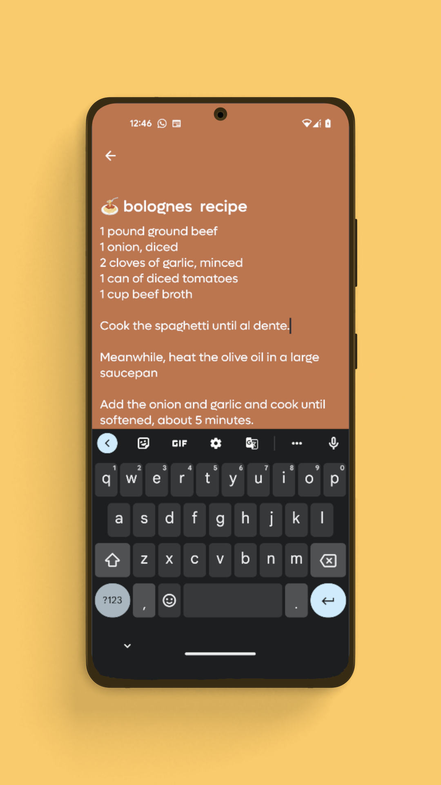
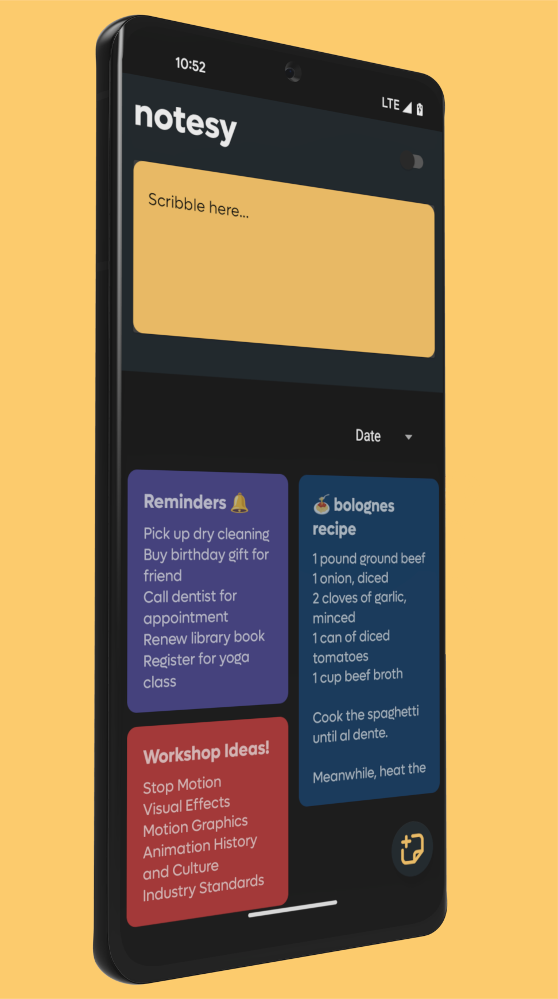
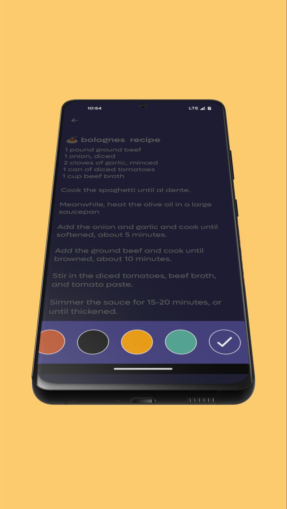

# Notesy - An AI based Notes App

Welcome to Notesy, a feature-packed AI-based notes app for Android. Whether you're jotting down ideas, composing a note, or working on a writing project, Notesy has everything you need to be productive and creative. 

## Key Features
- **Scribble pad:** Quickly jot down notes and ideas with our intuitive scribble pad. 
- **Compose note:** Create detailed notes with our full-featured note composer. 
- **Color Spectrum:** Customize the look of your notes with a variety of color options. 
- **AI Cowriter (Coming Soon):**  Notesy's AI Cowriter feature helps you overcome writer's block and create rough drafts with ease.

## Screenshots

  
   
  

## Tech Stack
Notesy is built on a robust tech stack, including: 
- **Kotlin:** The primary programming language used to develop the app. 
- **Coroutines:** A lightweight threading solution that makes it easy to write asynchronous code. 
- **Flows:** A reactive programming framework that enables real-time data streams in your app. 
- **Room DB:** A powerful database solution for storing and retrieving your notes. 

## Coming to Playstore soon!

